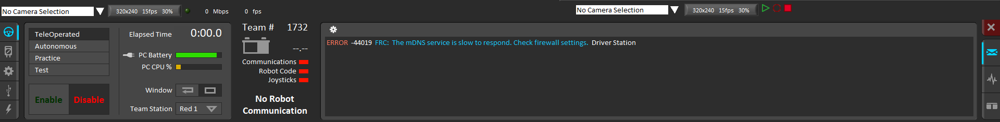
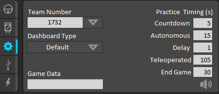
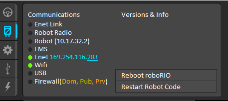
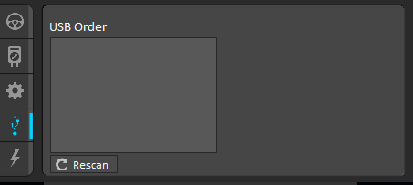
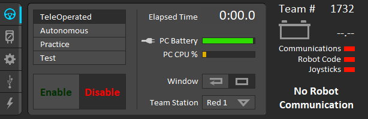
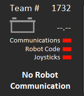
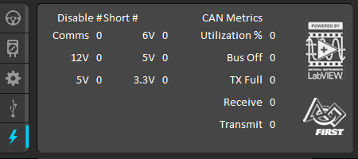

# Driverstation

The FRC Driverstation controls the robot. All communication with the robot occurs through the driverstation.

There are also several tool the driverstation provides, like allowing you to kill your programs at anytime, and receive output from the robot.

The FRC Driverstation is a program that you run on your computer, that interfaces with the roborio over any of the connections mentioned at the end of the Hello, World example.


The FRC Driverstation only runs on Windows. You can deploy from any computer, but you will need to have a Windows computer to run the driverstation on. If you are connected over wifi, more than one computer can connect, so you don't need to switch what computer you are plugged into.


### Installation



To install follow directions here: [https://wpilib.screenstepslive.com/s/currentCS/m/getting\_started/l/599670-installing-the-frc-update-suite-all-languages](https://wpilib.screenstepslive.com/s/currentCS/m/getting_started/l/599670-installing-the-frc-update-suite-all-languages)



### The Driverstation

 The Driverstation will typically launch with a basic dashboard above the actual station. For now, we'll focus only on the actual Driverstation shown above.

In the Driverstation, there are five main categories to work with. This includes the following, from top to bottom: operation, diagnostics, setup, USB devices, and Power & CAN. We will go over each of these categories and their importance to the robot in this tutorial.

### Setup Page \(I skipped the first two, but this is more important right now\)

**Team Number **- This is important as you must specify your team number so that you may properly link up to the robot.

**Practice Timing\(s\) **- These are the times in seconds that each part of the FRC game lasts. This is important for the "Practice" mode in the Operation page that I will elaborate on later in the tutorial.

**Dashboard Type - **This option allows you to select which type of dashboard you want to use to interface with your robot. This could be the default PC dashboard, SmartDashboard, or the ShuffleBoard, which will also be covered on in a different tutorial.

**Game Data **- 

### Diagnostics Page

**Enet Link **- 

**Robot Radio **- 

**Robot \(IP\) - **

**FMS -**

**Enet -**

**WIFI - **

**USB - **The status light will turn green if you have properly connected to your robot using a USB cable.

**Firewall **- The status light will turn green if your firewall is properly configured while you are connected to the robot.

### USB Devices Page

This page is important for identifying what devices you have connected to your computer that can control the robot. For example, this page might list your joysticks.

### Operation Page

Besides the dashboard, you will probably spend most of your time on this page of the Driverstation, as it has many key items that allow you to control your robot.

#### The Four Driving Modes

**TeleOperated - M**anually driving with your joysticks.

**Autonomous -** Used for - you guessed it - autonomous operation.

**Practice -** 

**Test -**

Note that the Driverstation is defaulted to having the robot disabled. When you select a mode, make sure you press the enable button so that the robot is functioning as you intend. If you must stop the robot in an emergency, especially when your robot's autonomous is not functioning as might be desired, press **space **to quickly disable the robot.

Also, in addition to these driving modes, there are also other miscellaneous items, including:

**Elasped Time **- How long your robot has been enabled.

**PC Battery **- Your own computer's battery.

**PC CPU **- The % of resources your CPU is using to run the actual Driverstation program.

**Window **- Where you want your Driverstation to be positioned. If you select the first option, it will act as a regular window. If you select the second option, the Driverstation will be glued onto the bottom of your screen.

**Team Station **- Allows you to specify your station when you are competing in a game.

#### Robot Communication

This will actually show up no matter what page you are on, but it is most helpful when you are trying to operate your robot.

**Team Number **- Make sure you have the correct team number specified here. You can do so by visiting the setup page mentioned before.

**Robot Battery **- There will be a status indicator right below the Team Number specifying the battery of your robot.

**Communications -** This will turn green if your computer has been properly connected to your robot.

**Robot Code **- This will turn green if you have successfully deployed robot code into the robot.

**Joysticks **- This will turn green if your joysticks are properly connected.

### Power & CAN

