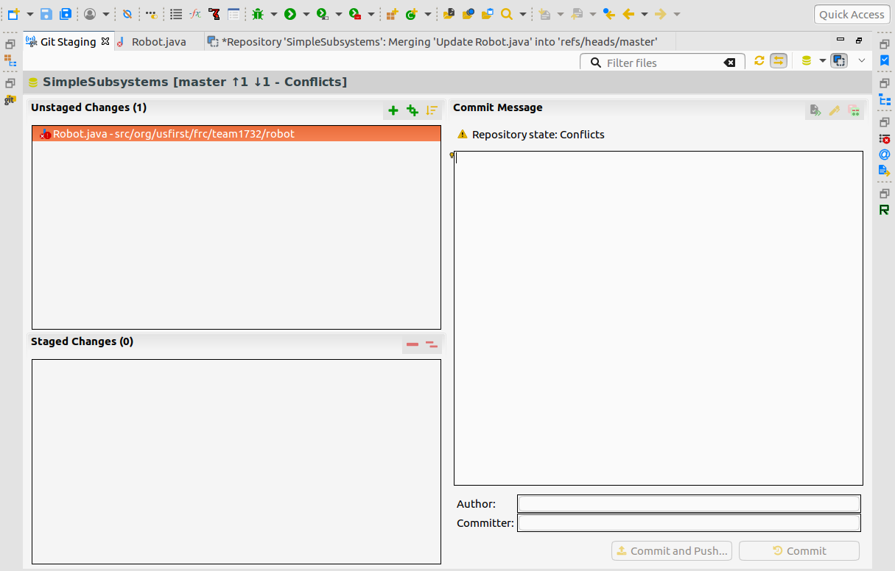
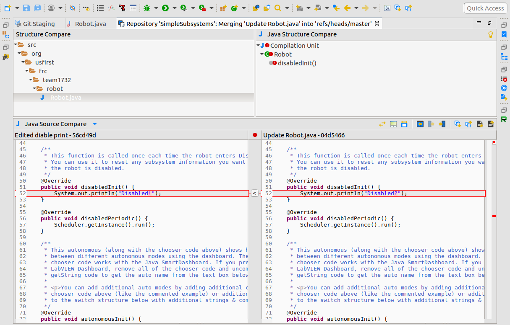

# Git / Github

Git is collaboration software intended for programming. Github is a free public Git server, where you can host your own git repositories. Git allows us to keep track of various changes and branches of code, sort of like a Google Docs for code.


Most FRC teams use Git and Github, including Team 1732


The tutorial here is for Github, ask your programming lead what your team uses.

### Clone a repository

To clone a repository in Eclipse, open the git panel. \(**WIndow **&gt;** Show view **&gt;** Other...** &gt; **Git Repositories**\)

From the git panel, click the clone button, and enter the clone url \(the green button on the upper right of the repository on github.com\).

Now the repository is on your computer, and it should show up in the Git Respositories view. If there are projects already in the repository, you can add them to the package explorer by right clicking the respository, and selecting import projects.

### Committing and Pushing

Once you have the repository on your computer, you can start editing it. Once you have made some changes, and want to share them back with the original repository, you need to commit and push them.

To do this, right click on the repository in the git view, and select **Commit**. In the view that pops up, all of the changes you have made show up on the top left. Move them to the bottom left by dragging them, and write a commit message on the right. This message is recorded with the commit, and should provide a quick description of the changes you have made since the last commit. Once you have chosen the changes to commit \(probably all of them\), select commit and push. This will save the changes you have made to a history that can be restored, and push them to Github. If you are not connected to a network, Commiting will still work, but you must wait until you are connected to the internet to push. Then, when you connect, right click on the repository, and select **Push**.

Becuase git only keeps track of commits, and not every edit, make sure to commit often. A good rule of thumb is to commit after every meeting, at the very least. More than likely, you should be commiting every version of the code you test on the robot.

### Pulling

If someone else has made changes, and pushed them to github, you can pull them to your computer by right clicking the repostory, and selecting **Pull**.

### Merging


If you get this wrong, it can take hours to fix the mess that this creates. Follow these instructions carefully


Most of the time, merging happen automatically, and behind the scenes. However, if there are conflicts, you will need to manually fix the issues. To do this, you will be given a commit screen of the conflicts:

If you right click on the conflicting file, you are given the options to **Replace With** one version or the other. If you can, simply select one, and add it to the staged changes. However, if you need to resolve the changes, you can open up the** Merge Tool**, which will allow you to decide whether specific changes should be added.

Once you have resolved the changes, add the file to the index, and commit the final version.

### Reverting Commits

When you right click on a git repository, you can open it up in **History**. If you do, you can see every commit made, and right clicking will provide the option to revert the commit.


Internally, reverting a commit just commits the exact opposite of what you originally committed. Git does not require you to revert commits in order, so you can revert a commit you made months ago, with out reverting everything else you have done since.


### Creating a repository

To create a Github repository, open up github.com, click the plus \(in the upper right\) and select **New Repository**. Give it a name, and make sure to add a readme file before clicking finish. Clone the repository to your computer, and exit Eclipse.

Next, go into your filesystem, and move the project you created from the eclipse workspace \(defualts to %USER HOME%/eclipseWorkspace\), into the git repository \(defualts to %USER HOM%/git\). Then open up Eclipse, and commit the changes to the repository.


It is possible to avoid closing eclipse, but you have to force eclipse to update from the filesystem. This can be acomplished via `F5 `but is not recommended for new users. Advanced users can also acomplish these tasks with the Git CLI, and repository creation is alot easier on the CLI.


